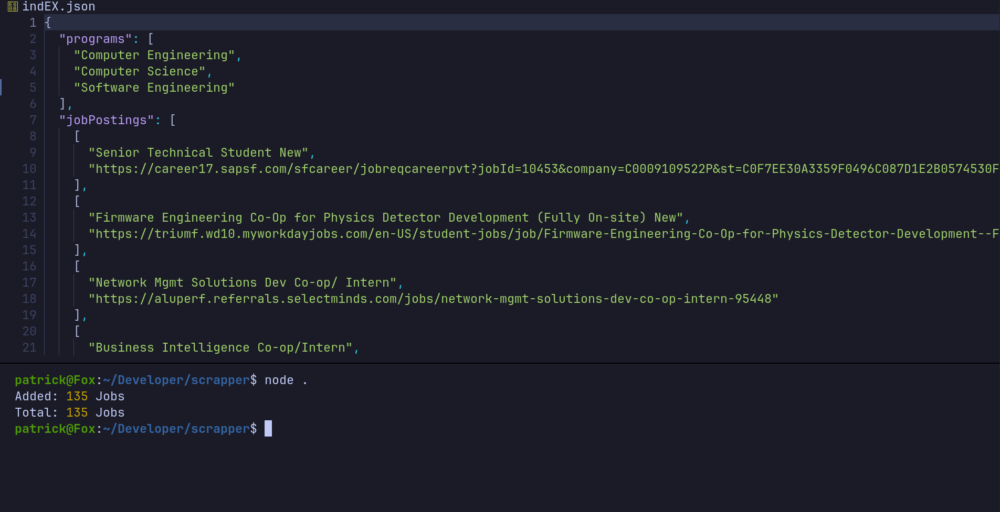

# COOP-Scraper



### **Stack**:

- NodeJS
- [cheerio.js](https://cheerio.js.org/)

## Setup:

```sh
git clone https://github.com/vian21/coop-scraper
```

```sh
cd coop-scraper
```

```sh
npm install
```

## Running:

```sh
node .
```

The sccript will generate an `indEX.json` with all the data.

## Adding to new data

The `HTML` content was scraped using an aunthenticated account on `Feb 21st 2022`. If you want to add new data or job postings:

1. Login to you indEX account
1. Select the faculty/programmes you want to summarize
1. Select the availablity and mobility
1. Apply filters
1. Right click -> View Page Source
1. Select all the content and copy it
1. Paste it in the `indEX.html` file

All done you can now run the script again by running `node .` in the terminal.
